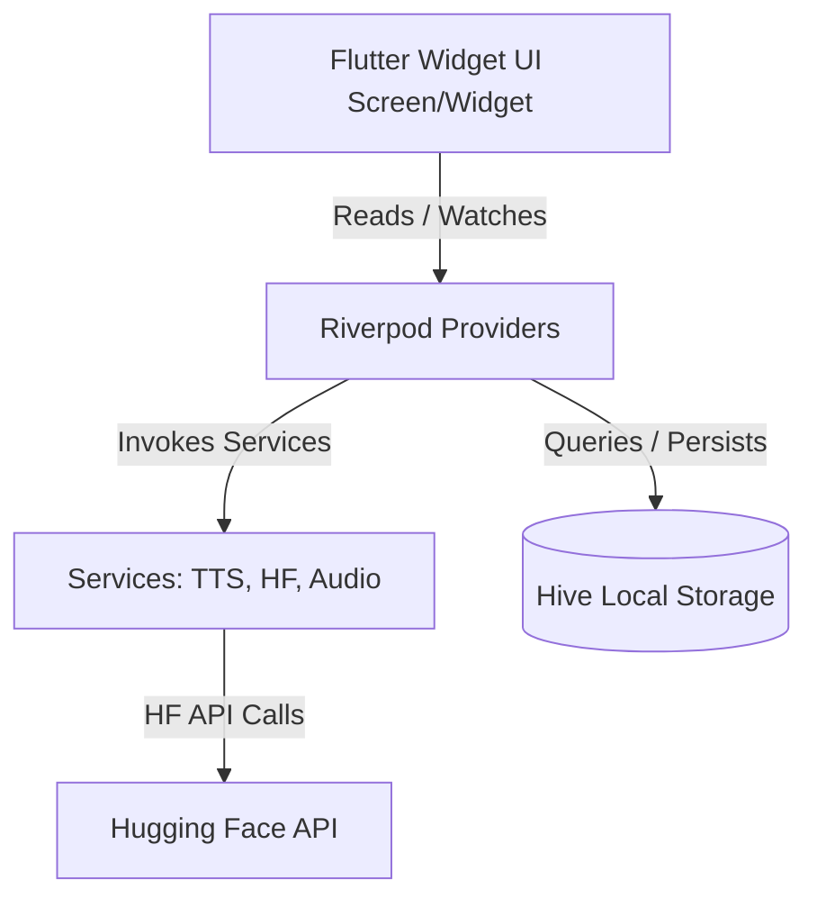

# 🇩🇪 GermanLoop

GermanLoop is a modern, Bauhaus-inspired Flutter application designed for intuitive, voice-first German language learning. By bridging the gap between real-world spoken expression and structured grammar foundations, GermanLoop acts as a personalized translation, pronunciation, and vocabulary assistant.

---

## 🎨 Design System & Philosophy

GermanLoop adheres to a strict, premium **Bauhaus-inspired design aesthetic**. The interface is minimal, responsive, and emphasizes structure, content hierarchy, and typography without unnecessary visual noise.

*   **Color Palette:**
    *   `Paper` (Clean background tone)
    *   `Ink` & `Ink Muted` (High-contrast typography)
    *   `Cobalt` (Primary focus, navigation, and interactive buttons)
    *   `Mustard` (Contextual callouts, pronunciation indicators, and highlights)
    *   `Brick` (Error states, warning cues, and "Hard" reviews)
    *   `Teal` (Completed milestones, success indicators, and "Easy" reviews)
*   **Typography:**
    *   *Space Grotesk:* Dynamic, structural headers and titles.
    *   *IBM Plex Sans:* Legible, clean body and translation text.
    *   *IBM Plex Mono:* Technical labels, metadata, and language details.
*   **Aesthetics:** Flat design with hairline borders, precise grids, $12\text{px}$ corner radii, and zero generic elevation shadows.

---

## 🚀 Key Features

### 1. The Speech & Translation Pipeline
*   **Voice-to-Phrase:** Record your natural spoken thoughts in English.
*   **Hugging Face Integration:** Uses cloud-based ML pipelines for automatic Speech-to-Text (STT), translation (EN $\rightarrow$ DE), and Text-to-Speech (TTS) using `facebook/mms-tts-deu`.
*   **Interactive Gloss Strip:** Every translation generates a horizontal ribbon of matching word-gloss tiles (German above, English below) with optional highlight states for granular analysis.

### 2. Word-Level Audio & Caching
*   **Interactive Pronunciation:** Play single words from translation strips, lessons, or flashcards instantly.
*   **Hive-Powered Caching:** Synthesized WAV files are cached locally in Hive (mapped word $\rightarrow$ file path). Subsequent plays load instantaneously and data-free.
*   **Device Fallback:** Falls back automatically to device-native `flutter_tts` if a network timeout or Hugging Face API limit is reached.

### 3. Goethe-Institut A1 Foundations Track
A curriculum of 10 structured beginner lessons designed around the Goethe A1 grammar syllabus:
1.  **The Alphabet & Core Sounds** (Special characters and full pronunciation rules breakdown)
2.  **Numbers** (0–100, prices, and counting)
3.  **Greetings & Time of Day** (Formal vs. informal interactions)
4.  **Pronouns, *sein* & *haben*** (Interactive pronoun tables and conjugation widgets)
5.  **Sentence Word Order** (Subject-verb placement, modal verb end-jumping)
6.  **Articles, Gender & Formal Address** (*der/die/das* rules and *du* vs. *Sie* nuances)
7.  **Question Words** (*wer, was, wo, wann, warum, wie, wie viel*)
8.  **Food, Shopping & Prices** (Cafe vocabulary and billing)
9.  **Family** (Possessive markers like *mein* and *meine*)
10. **Travel & Directions** (Navigating cities)

*All vocabulary items in the Foundations track can be bookmarked to add them directly to your flashcard review stack.*

### 4. Interactive Pronunciation Rules
*   **Pattern Matching:** The application automatically scans German text for 21 common phonetic patterns (e.g., `ch`, `sch`, `sp/st`, umlauts, long/short vowel helpers).
*   **Visual Indicators:** Words with matching pronunciation rules are indicated with a subtle Mustard dot. Tapping the word opens a bottom sheet showing exactly how the letters should be voiced.

### 5. Spaced Repetition (SM-2) Review System
*   **Active Recall:** Cards are scheduled using the SuperMemo SM-2 algorithm based on your rating (Hard, Medium, Easy).
*   **Smart Filters:** Review cards from "All", "Personal" (recorded phrases), or "Foundations" (bookmarked vocabulary) independently.
*   **Answer Reveal:** Reveals the translation, a full Gloss Strip with pronunciation markers, and voice playback controls.

### 6. Foundations Progress Nudge
*   Located on the Home (Record) screen beneath the recent translation list, this widget dynamically reminds you of your next uncompleted lesson, displaying a preview word and quick play controls.

---

## 🛠️ Architecture & State Management

GermanLoop is built with a highly decoupled, modern Flutter architecture:



*   **State Management:** **Riverpod** is used exclusively, dividing logic into small, unit-testable Notifier classes.
*   **Local Persistence:** **Hive** handles data storage across 4 active boxes:
    *   `phrases`: Stores all `PhraseModel` items (SM-2 intervals, dates, categories, alternates).
    *   `settings`: Saves the API tokens and preferences.
    *   `word_audio`: Caches the file paths of generated single-word WAVs.
    *   `foundations_progress`: Tracks completion flags (`lesson_N` $\rightarrow$ `bool`).
*   **Security:** Hugging Face Personal Access Tokens are written and read securely using `flutter_secure_storage`.

---

## 💻 Tech Stack & Dependencies

*   **Core:** Flutter & Dart
*   **State Management:** `flutter_riverpod`
*   **Database:** `hive_flutter`
*   **Network:** `dio`
*   **Audio Recording:** `record`
*   **Audio Playback:** `just_audio`
*   **Speech Synthesis (Fallback):** `flutter_tts`
*   **Secure Storage:** `flutter_secure_storage`
*   **Directories:** `path_provider`

---

## ⚙️ Setup & Installation

### Prerequisites
*   Flutter SDK (v3.19.0 or higher recommended)
*   Dart SDK (v3.3.0 or higher)
*   A Hugging Face account and Personal Access Token (for Speech-to-Text and TTS API integrations)

### Installation Steps

1.  **Clone the Repository:**
    ```bash
    git clone https://github.com/HammadAli08/German-Learning-App.git
    cd German-Learning-App
    ```

2.  **Install Dependencies:**
    ```bash
    flutter pub get
    ```

3.  **Run Code Generation (if modifying Hive adapters):**
    ```bash
    flutter pub run build_runner build --delete-conflicting-outputs
    ```

4.  **Configure API Credentials:**
    *   Launch the app on your emulator or physical device.
    *   Navigate to the **Settings** tab.
    *   Enter your **Hugging Face API Token** in the input field to enable translation and transcription features.

5.  **Run the App:**
    ```bash
    flutter run
    ```

---

## 🤝 Contributing & Extension

When contributing new screens or rules to GermanLoop:
1.  **Maintain UI Consistency:** Use spacing multipliers of $8\text{px}$. Ensure all widgets utilize `AppColors` and `AppTextStyles` tokens exclusively.
2.  **Add to the Database Safely:** When updating the `PhraseModel`, increase the fields count in the manual `PhraseModelAdapter` located in `lib/data/models/phrase_model.g.dart` to support safe null-fallback defaults.
3.  **Modular Logic:** Keep widgets stateless where possible and utilize Riverpod's `select` modifiers to prevent unnecessary UI rebuilds.
